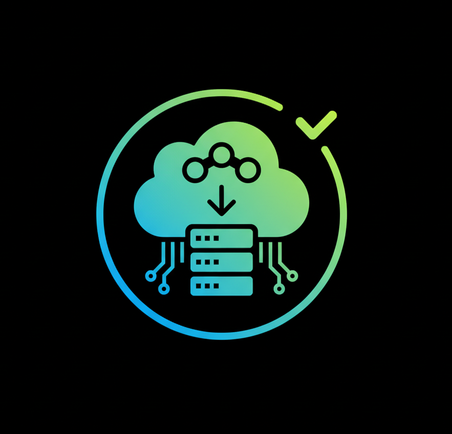

## Nextcloud

<p align="center">
  
</p>

**Nextcloud** es una plataforma de almacenamiento y colaboración de código abierto que permite gestionar y compartir archivos, colaborar en documentos, organizar calendarios y tareas, y más.  
Este repositorio incluye un script para configurar tu propia nube de manera sencilla.

---

## ⚙️ Requisitos

- Sistema operativo: Linux (Ubuntu/Debian recomendado)
- Servidor web: Apache
- Base de datos: MySQL
- PHP 7.4 o superior con extensiones necesarias (gd, curl, zip, xml, etc.)

---

## 🚀 Instalación

Clona el repositorio y accede al directorio:

```bash
git clone https://github.com/Devsebastian44/Nextcloud.git
cd Nextcloud
```

Configura el entorno:

```bash
chmod +x setup.sh
sudo bash setup.sh
```

**NOTA:** Durante la instalación se solicitará varias veces la contraseña de MySQL.  
Debes ingresar la misma contraseña que configuraste previamente.

---

## ▶️ Uso

Una vez finalizada la instalación, accede a tu servidor desde el navegador:

```
http://localhost/nextcloud
```

---

## 📂 Estructura del proyecto

```
Nextcloud/
│── scripts/              # Carpeta con scripts auxiliares
│   │── setup.sh          # Script de instalación inicial
│   │── configuracion.sh  # Script para configurar parámetros de Nextcloud
│   │── directorios.sh    # Script para bloquear y proteger otros directorios
│── setup.sh              # Instala dependencias y configura la base inicial.
```

---

## 📜 Licencia

Este proyecto está bajo la licencia GPL.  
Puedes usarlo libremente con fines educativos y de investigación.